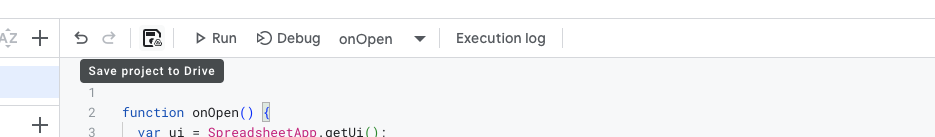

# How to extract google maps leads for free

This guide will show you how to:
1. Create a RapidAPI account.
2. Retrieve your API key from RapidAPI.
3. Set up a Google Spreadsheet to use the API and fetch leads automatically to your sheet.

---

## 1. Create a RapidAPI Account

### Step 1: Visit the RapidAPI Website
- Open your browser and go to [RapidAPI](https://rapidapi.com).

### Step 2: Sign Up or Log In
- **New User:** Click **Sign Up** and complete the registration process using your email, Google, or GitHub account.
- **Existing User:** Click **Log In** and enter your credentials.

---
## Instructions to Get Your RapidAPI Key and subscribe to the Google Maps Extractor API

### 1. Subscribe to the API
1. Visit the [Google Maps Extractor](https://rapidapi.com/flybyapi1/api/google-maps-extractor2/pricing) API.
2. Choose the **Free Plan** (40 queries per month, each query retrieving up to 100 businesses).
3. Click **Subscribe** to activate the plan.


### 2. Access Your API Key
1. Go to the [Playground page for the API](https://rapidapi.com/flybyapi1/api/google-maps-extractor2/playground/apiendpoint_546ddc30-be34-4777-876d-d60b72114691).
2. In the **Code Snippets** tab, locate your `x-rapidapi-key`.
3. Copy the API key displayed for use in your applications. You'll have to use it later...


### Notes
- The API key is essential for authenticating requests.
- Ensure you stay within the limits of the Free Plan (40 queries per month).
If you need more than 40 queries (around 4000 leads), you can subscribe to the other plans.

---

## 3. Set Up a Google Spreadsheet

### Step 1: Open Google Sheets
- Go to [Google Sheets](https://sheets.google.com) and create a new spreadsheet.

### Step 2: Organize the Spreadsheet
- **Column A:** Enter queries (e.g., "restaurants in New York").
- **Column B:** Optional: Specify the number of results (`limit`).
- **Column C:** Optional: Specify the language code (e.g., `en`).

---

## 4. Create a Google Apps Script

### Step 1: Open the Apps Script Editor
- In your Google Sheet, click on `Extensions > Apps Script`.

### Step 2: Paste the Code
1. Delete any existing code in the editor.
2. Copy and paste the following script:
IMPORTANT: Replace `YOUR_RAPIDAPI_KEY` with your actual RapidAPI key. (the one I said you to save for later, do you remember?;))

```javascript
function onOpen() {
  var ui = SpreadsheetApp.getUi();
  ui.createMenu('GMaps')
    .addItem('Fetch Data', 'fetchDataAndUpdateSheets')
    .addToUi();
}

function fetchDataAndUpdateSheets() {
  var mainSheet = SpreadsheetApp.getActiveSpreadsheet().getSheetByName("Sheet1"); // Your main sheet name
  var apiBaseURL = "https://google-maps-business-secrets.p.rapidapi.com/locate_and_search?query=";

  // RapidAPI headers
  var options = {
    method: "GET",
    headers: {
      "x-rapidapi-host": "google-maps-business-secrets.p.rapidapi.com",
      "x-rapidapi-key": "YOUR_RAPIDAPI_KEY"
    }
  };

  // Get the last row of queries from column A in Sheet1
  var lastRow = mainSheet.getLastRow();

  // Loop through rows, starting from row 2 (skipping the header)
  for (var i = 2; i <= lastRow; i++) {
    var query = mainSheet.getRange(i, 1).getValue(); // Get the query from column A
    var limit = mainSheet.getRange(i, 2).getValue() || 20; // Get limit from column B or default to 20
    var language = mainSheet.getRange(i, 3).getValue() || "en"; // Get language from column C or default to 'en'

    if (query) {
      var sheetName = query.substring(0, 30); // Limit sheet name to 30 characters
      var sheet = SpreadsheetApp.getActiveSpreadsheet().getSheetByName(sheetName);

      var offset = 0;
      if (sheet) {
        offset = sheet.getLastRow() - 2;
      } else {
        sheet = SpreadsheetApp.getActiveSpreadsheet().insertSheet(sheetName);
        sheet.getRange(1, 1).setValue("Query: " + query);
      }

      var url = `${apiBaseURL}${encodeURIComponent(query)}&offset=${offset}&limit=${limit}&language=${language}`;
      var response = UrlFetchApp.fetch(url, options);
      var data = JSON.parse(response.getContentText());

      if (data && data.data && Array.isArray(data.data)) {
        var results = data.data;

        if (offset === 0 && results.length > 0) {
          var headers = Object.keys(results[0]);
          sheet.getRange(2, 1, 1, headers.length).setValues([headers]);
        }

        if (results.length > 0) {
          var headers = Object.keys(results[0]);
          var values = results.map(item => headers.map(header => item[header] || "N/A"));
          var startRow = sheet.getLastRow() + 1;
          sheet.getRange(startRow, 1, values.length, values[0].length).setValues(values);
        }
      }
    }
  }
}
```
## 5. Test the Script

### Step 1: Refresh the Menu
- Save the script, close the editor, and refresh the spreadsheet.


- You’ll see a new menu option in spreadsheets called **GMaps**.


### Step 2: Fetch Data
- Click `GMap > Fetch Data` to run the script.
- The script will create new sheets with data for each query in Column A.

### Step 3: How the Script Works
- Every time you run the script, it will:
  1. Check for new data from the API for each keyword in **Column A**.
  2. Append additional leads to the end of each existing sheet that matches the keyword.
  3. Stop appending if no new data is found from the API.

#### Column Details:
- **Column A (Keyword):**  
  Enter the keywords you want to search for (e.g., "restaurants in New York"). Each keyword will have its own sheet where results are stored.
  
- **Column B (Number of Elements):**  
  Specify the number of results to fetch from the API for each keyword. If left empty, the script will default to fetching `20` results. To reset and fetch fresh leads, set this column to `0` after reviewing the current data.

- **Column C (Language):**  
  Enter the language code for the data you want to retrieve (e.g., `en` for English). If left empty, the script defaults to `en`.

#### Best Practices:
- To avoid redundant API calls:
  - Reset the **Number of Elements (Column B)** to `0` before running the script again.
  - If Column B is not reset, the script will continue from the previous offset and may return zero results, wasting API usage.


- **Best Practices:**
  - It's recommended to set the **number column** (Column B) back to `0` after fetching leads.  
    - This ensures the script fetches fresh leads from the beginning and avoids unnecessary API calls that return zero results.
  - Without resetting Column B to `0`, the script will call the API at the previous offset value. If no new leads are found, the API will return an empty result, wasting your API usage.

### Example Workflow:
1. Run the script to fetch leads.
2. Review the results in the sheets created for each keyword.
3. Reset Column B values to `0` for the next run to start fetching leads from the beginning.
4. Avoid calling the API unnecessarily if no new leads are expected.


---

## Additional Notes

- **Rate Limits:** Ensure your usage complies with RapidAPI's rate limits.
- **Error Handling:** If no data is returned, ensure the query is valid and the API key is active.
